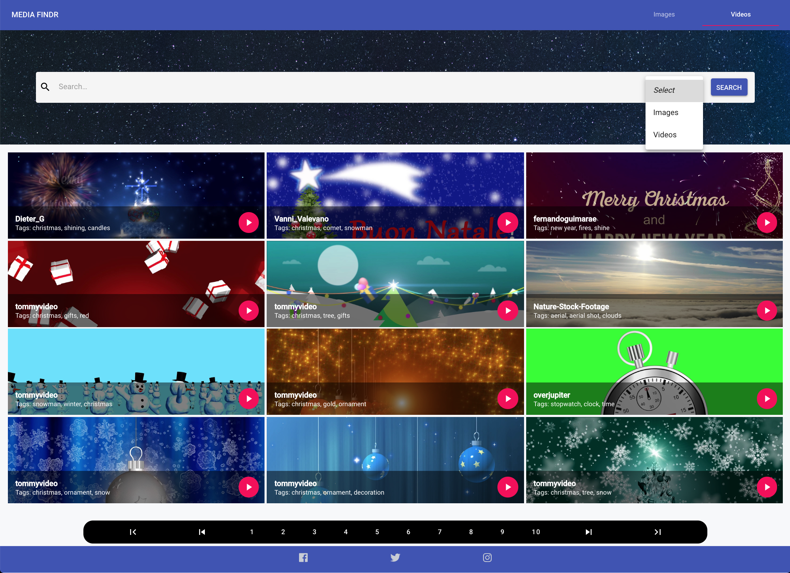
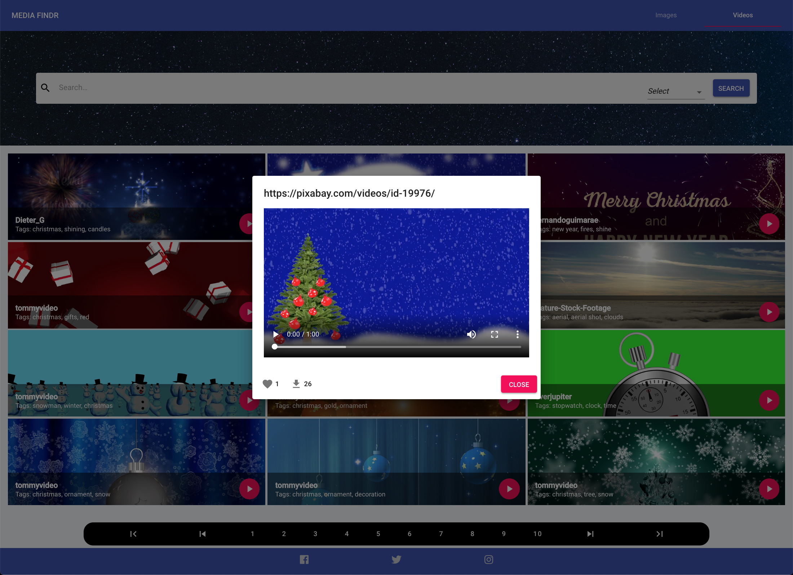

# Media-Findr

## Introduction
Find images and videos using the PixaBay API.

## Get Pixabay API
- register an account at https://pixabay.com
- login > go to https://pixabay.com/api/docs/ > scroll down > under the heading, Search Images > Parameters > key
- Once generated, create a new file called ".env" and input 
`REACT_APP_APP_KEY='YOUR_APP_KEY'` and save.

## Installation
- Install dependencies: `npm install`
- Run server: `npm start`

## Dependencies
- `create-react-app`
- `@material-ui/core`
- `@material-ui/icons` 
- `@fortawesome/fontawesome-svg-core`
- `@fortawesome/free-brands-svg-icons`
- `@fortawesome/react-fontawesome`
- `react-number-format`
- `react-router-dom`

## Final Product

